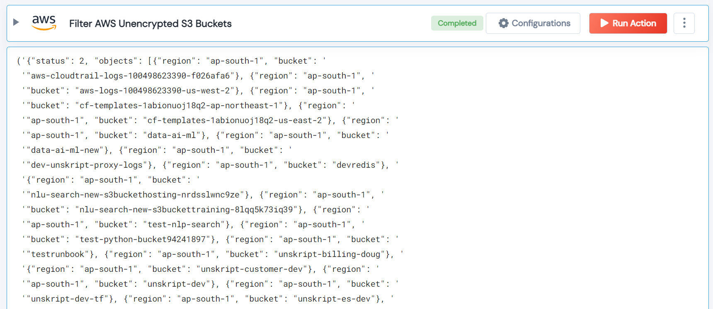

 
<h1>Filter AWS Unencrypted S3 Buckets </h1>

## Description
This Lego filter AWS unencrypted S3 buckets and gives a list of unencrypted s3 buckets.

## Lego Details

    aws_filter_unencrypted_s3_buckets(handle: object, region: str)

        handle: Object of type unSkript AWS Connector
        region: Location of the S3 buckets.

## Lego Input
This Lego takes take one input region. 

## Lego Output
Here is a sample output.

## See it in Action

You can see this Lego in action following this link [unSkript Live](https://us.app.unskript.io)