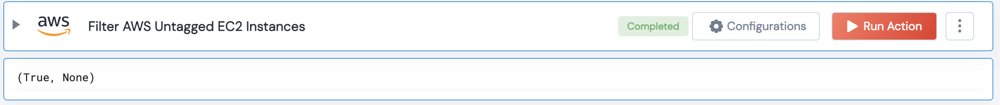

 
<h1>AWS Filter Untagged EC2 Instances </h1>

## Description
This Lego filter the AWS Untagged EC2 Instances.

## Lego Details

    aws_filter_untagged_ec2_instances(handle: object, region: str)

        handle: Object of type unSkript AWS Connector
        region: region: Optional, AWS region. Eg: “us-west-2”

## Lego Input

This Lego take two inputs handle and region.

## Lego Output
Here is a sample output.

## See it in Action
You can see this Lego in action following this link [unSkript Live](https://us.app.unskript.io)