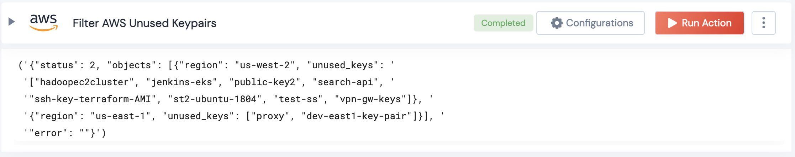

 
<h1>Filter AWS Unused Keypairs </h1>

## Description
This Lego Filter AWS Unused Keypairs and gives a list of keypairs.

## Lego Details

    aws_filter_unused_keypairs(handle: object, region: str)

        handle: Object of type unSkript AWS Connector
        region: Region to filter instances.

## Lego Input
This Lego take two inputs handle and region. 

## Lego Output
Here is a sample output.

## See it in Action

You can see this Lego in action following this link [unSkript Live](https://unskript.com)