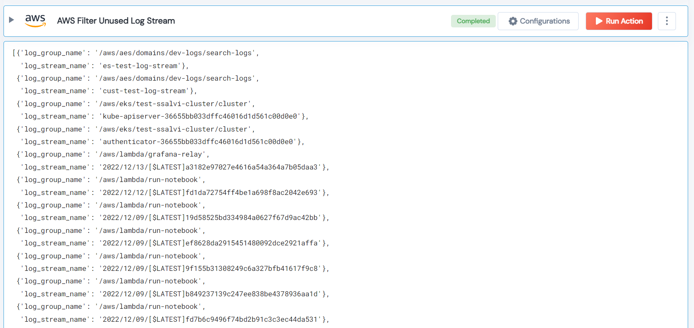

 
<h1>AWS Filter Unused Log Stream</h1>

## Description
This Lego lists all log streams that are unused for all the log groups by the given threshold.

## Lego Details

    aws_filter_unused_log_streams(handle, region: str, time_period_in_days: int = 30)

        handle: Object of type unSkript AWS Connector.
        time_period_in_days: Optional, (in days) The threshold to filter the unused log strams.
        region: Optional, AWS Region.
## Lego Input

This Lego take three inputs handle, time_period_in_days and region.

## Lego Output
Here is a sample output.

## See it in Action

You can see this Lego in action following this link [unSkript Live](https://us.app.unskript.io)