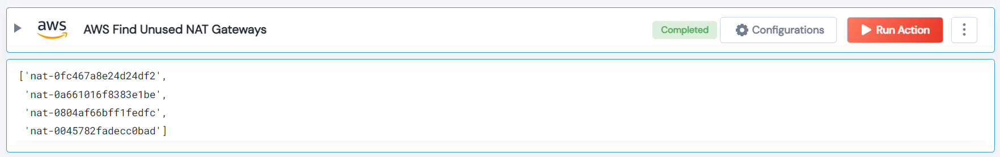

 
<h1>AWS Find Unused NAT Gateways </h1>

## Description
This Lego get all of the Nat gateways that have zero traffic over those.

## Lego Details

    aws_filter_unused_nat_gateway(handle, number_of_days: int, region: str)

        handle: Object of type unSkript AWS Connector
        region: Region to filter instances.
        number_of_days: Number of days to check the Datapoints.

## Lego Input
This Lego take three inputs handle, number_of_days and region.

## Lego Output
Here is a sample output.

## See it in Action

You can see this Lego in action following this link [unSkript Live](https://unskript.com)