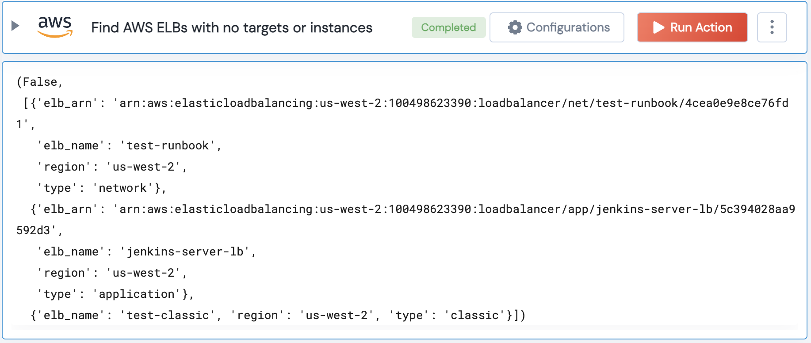

[]
(https://unskript.com/assets/favicon.png)
<h1>Find AWS ELBs with no targets or instances</h1>

## Description
Find AWS ELBs with no targets or instances attached to them.

## Lego Details
	aws_find_elb_with_no_targets_or_instances(handle, region: str = "")
		handle: Object of type unSkript AWS Connector.
		region: Optional, AWS region

## Lego Input
This Lego takes inputs handle,region.

## Lego Output
Here is a sample output.

## See it in Action

You can see this Lego in action following this link [unSkript Live](https://us.app.unskript.io)