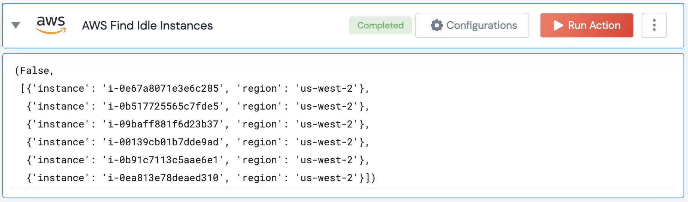

[]
(https://unskript.com/assets/favicon.png)
<h1>AWS Find Idle Instances</h1>

## Description
Find Idle EC2 instances

## Lego Details
	aws_find_idle_instances(handle, idle_cpu_threshold:int, idle_duration:int, region:str='')

		handle: Object of type unSkript AWS Connector.
		idle_cpu_threshold: (in percent) Idle CPU threshold (in percent)
		idle_duration: (in hours) Idle CPU threshold (in hours)
		region: AWS Region to get the instances from. Eg: "us-west-2"

## Lego Input
This Lego takes inputs handle,

## Lego Output
Here is a sample output.

## See it in Action

You can see this Lego in action following this link [unSkript Live](https://us.app.unskript.io)