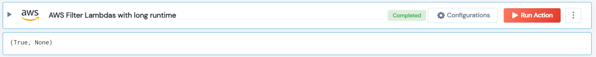

 
<h1>AWS Filter Lambdas with Long Runtime</h1>

## Description
This Lego used to retrieves a list of all Lambda functions and searches for log events for each function for given runtime(duration).

## Lego Details

    aws_find_long_running_lambdas(handle, days_back: int = 7, duration_threshold: int = 500, region: str = "")

        handle: Object of type unSkript AWS Connector.
        days_back: Optional, (In days) An integer specifying the number of days to search back for logs.
        duration_threshold: Optional, (In milliseconds) specifying the threshold for the minimum runtime of a Lambda function.
        region: Optional, AWS Region.
## Lego Input

This Lego take four inputs handle, days_back, duration_threshold and region.

## Lego Output
Here is a sample output.

## See it in Action

You can see this Lego in action following this link [unSkript Live](https://us.app.unskript.io)