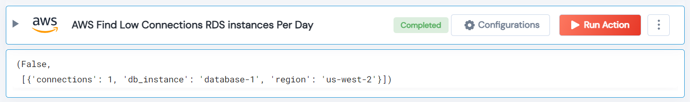

 
<h1>AWS Find Low Connections RDS instances Per Day</h1>

## Description
This Lego finds RDS DB instances with a number of connections below the specified minimum in the specified region.

## Lego Details

    aws_find_low_connection_rds_instances(handle, min_connections:int = 10, region: str = "")

        handle: Object of type unSkript AWS Connector.
        region: Optional, AWS region. Eg: “us-west-2”
        min_connections: Optional, the minimum number of connections for an instance to be considered active.

## Lego Input
This Lego take three inputs handle, min_connections and region.

## Lego Output
Here is a sample output.

## See it in Action
You can see this Lego in action following this link [unSkript Live](https://us.app.unskript.io)