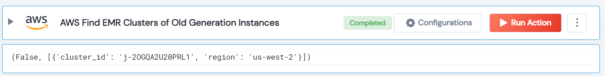

 
<h1>AWS Find EMR Clusters of Old Generation Instances</h1>

## Description
This Lego list of EMR clusters of old generation instances.

## Lego Details

    aws_find_old_gen_emr_clusters(handle, region: str = "")

        handle: Object of type unSkript AWS Connector.
        region: Optional, AWS region. Eg: “us-west-2”

## Lego Input
This Lego take two inputs handle and region.

## Lego Output
Here is a sample output.

## See it in Action
You can see this Lego in action following this link [unSkript Live](https://us.app.unskript.io)