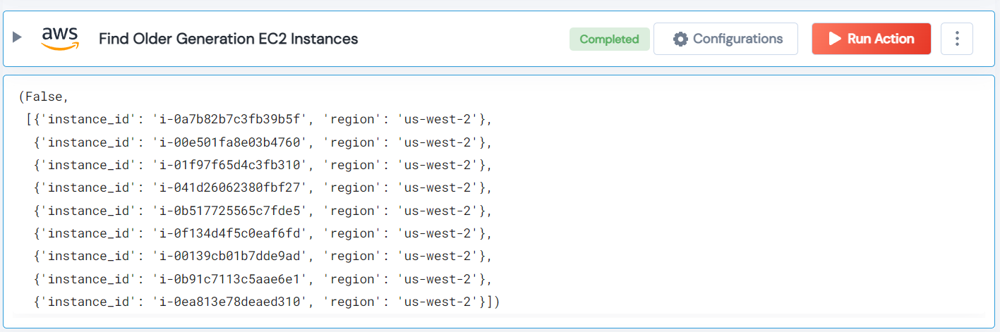

 
<h1>Find Older Generation EC2 Instances</h1>

## Description
This action finds older generation EC2 instances, which are ['t2', 'm1', 'm2', 'm3', 'm4', 'c1', c3] type.

## Lego Details

    aws_find_older_generation_ec2_instances(handle, region: str = "")
        handle: Object of type unSkript AWS Connector.
        region: Optional, AWS region. Eg: “us-west-2”.

## Lego Input
This Lego take two inputs handle and region.

## Lego Output
Here is a sample output.

## See it in Action
You can see this Lego in action following this link [unSkript Live](https://us.app.unskript.io)