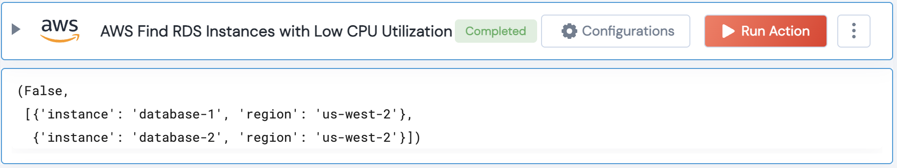

[]
(https://unskript.com/assets/favicon.png)
<h1>AWS Find RDS Instances with low CPU Utilization</h1>

## Description
This lego finds RDS instances are not utilizing their CPU resources to their full potential.

## Lego Details
	aws_find_rds_instances_with_low_cpu_utilization(handle, utilization_threshold=10, region: str = "", duration_minutes=5)
		handle: Object of type unSkript AWS Connector.
		utilization_threshold: The threshold percentage of CPU utilization for an RDS Instance.
		duration_minutes: Value in minutes to get the start time of the metrics for CPU Utilization

## Lego Input
This Lego takes inputs handle, utilization_threshold, duration_minutes.

## Lego Output
Here is a sample output.

## See it in Action

You can see this Lego in action following this link [unSkript Live](https://us.app.unskript.io)