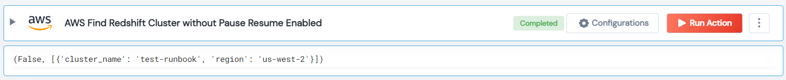

 
<h1>AWS Find Redshift Cluster without Pause Resume Enabled</h1>

## Description
This Lego find AWS redshift cluster for which paused resume are not Enabled.

## Lego Details

    aws_find_redshift_cluster_without_pause_resume_enabled(handle, region: str = "")

        handle: Object of type unSkript AWS Connector
        region: Optional, AWS Region.

## Lego Input
This Lego take two inputs handle and region. 

## Lego Output
Here is a sample output.

## See it in Action

You can see this Lego in action following this link [unSkript Live](https://us.app.unskript.io)