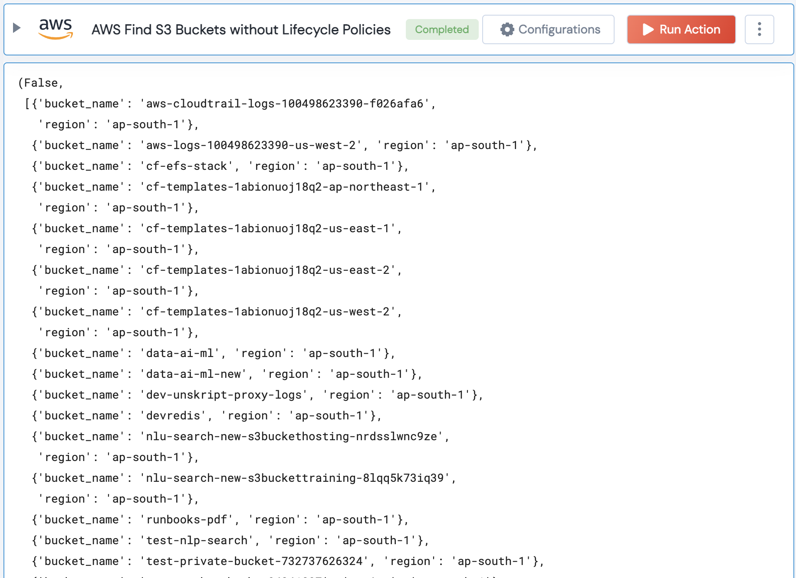

[]
(https://unskript.com/assets/favicon.png)
<h1>AWS Find S3 Buckets without Lifecycle Policies</h1>

## Description
S3 lifecycle policies enable you to automatically transition objects to different storage classes or delete them when they are no longer needed. This action finds all S3 buckets without lifecycle policies. 

## Lego Details
	aws_find_s3_buckets_without_lifecycle_policies(handle, region: str="")
		handle: Object of type unSkript AWS Connector.
		region: AWS Region of the bucket

## Lego Input
This Lego takes inputs handle and region.

## Lego Output
Here is a sample output.

## See it in Action

You can see this Lego in action following this link [unSkript Live](https://us.app.unskript.io)