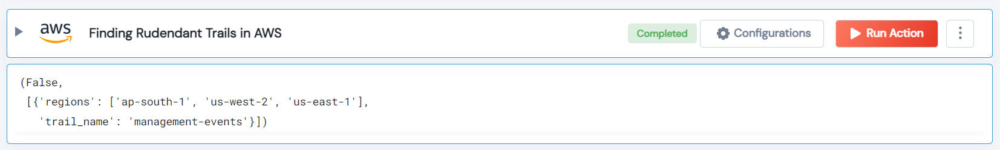

 
<h1>Finding Redundant Trails in AWS </h1>

## Description
This Lego finds the redundant cloud trails from AWS if the attribute IncludeGlobalServiceEvents is true because it records global events.

## Lego Details

    aws_finding_redundant_trails(handle: object)

        handle: Object of type unSkript AWS Connector.

## Lego Input
This Lego take one input handle.

## Lego Output
Here is a sample output.

## See it in Action

You can see this Lego in action following this link [unSkript Live](https://us.app.unskript.io)