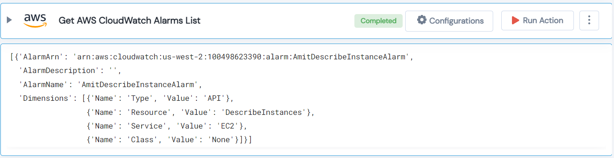

 
<h1>Get AWS CloudWatch Alarms List </h1>

## Description
This Lego get AWS CloudWatch Alarms List.

## Lego Details

    aws_get_alarms_list(handle: object, region: str, alarm_name: str)

        handle: Object of type unSkript AWS Connector.
        alarm_name: Name of the particular alarm in the cloudwatch.
        region: AWS Region of the cloudwatch.

## Lego Input

This Lego take three inputs handle, alarm_name and region. 

## Lego Output
Here is a sample output.

## See it in Action

You can see this Lego in action following this link [unSkript Live](https://us.app.unskript.io)