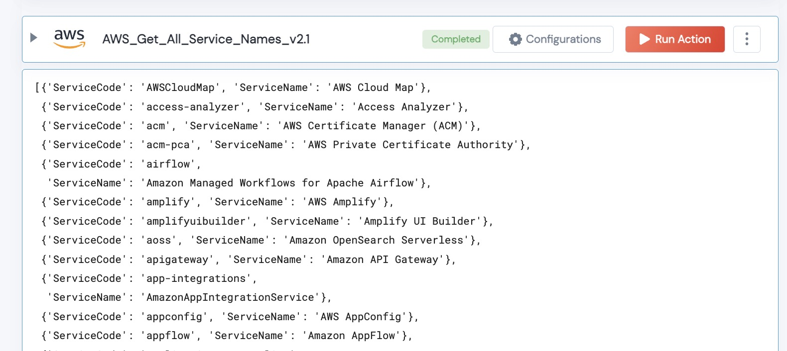

 
<h1>AWS Get All Service Names </h1>

## Description
For a given region, this Action will output all the Service Names

## Lego Details

    def aws_get_all_service_names(handle, region:str) -> List:

        handle: Object of type unSkript AWS Connector
        region: Location of the S3 buckets.

## Lego Input
This Lego take two inputs handle and region.

## Lego Output
Here is a sample output.

## See it in Action

You can see this Lego in action following this link [unSkript Live](https://us.app.unskript.io)

