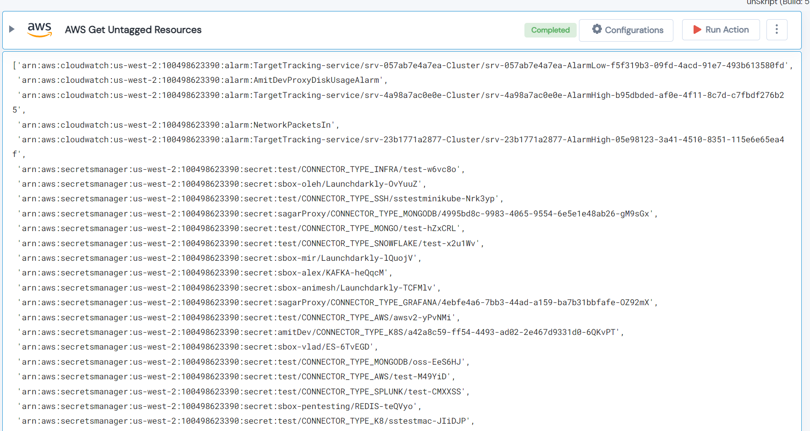

 
<h1>AWS Get Untagged Resources </h1>

## Description
This Lego filters all the untagged resources of given region and returns list of resource ARNs.

## Lego Details

    aws_get_untagged_resources(handle, region: str)

        handle: Object of type unSkript AWS Connector.
        region: Region to filter resources.

## Lego Input
This Lego take two inputs handle and region.

## Lego Output
Here is a sample output.

## See it in Action

You can see this Lego in action following this link [unSkript Live](https://unskript.com)