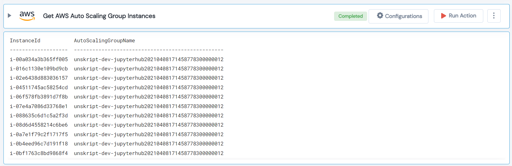

 
<h1>Get AWS Auto Scaling Group Instances </h1>

## Description
This Lego filter AWS autoscaling group instances and returns list of instance id and group name.

## Lego Details

    aws_get_auto_scaling_instances(handle, instance_ids: List, region: str)

        handle: Object of type unSkript AWS Connector
        instance_ids: List of instances.
        region: Region to filter instances.

## Lego Input
This Lego take three inputs handle, instance_ids and region.

## Lego Output
Here is a sample output.

## See it in Action

You can see this Lego in action following this link [unSkript Live](https://unskript.com)