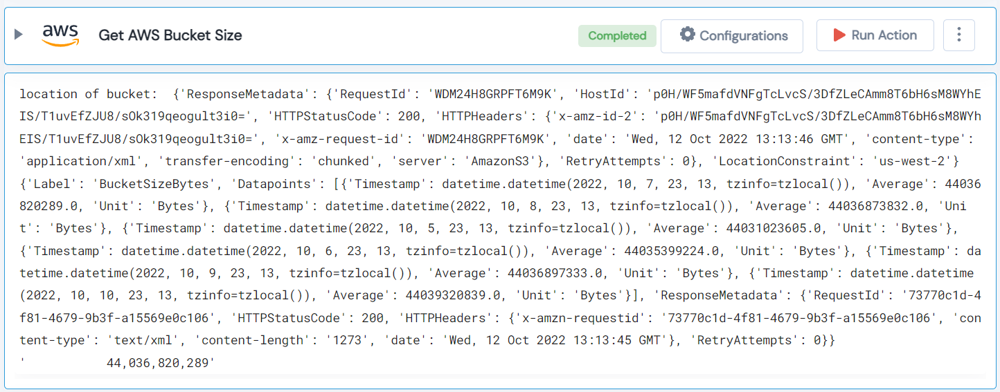

 
<h1>Get AWS Bucket Size </h1>

## Description
This Lego used to get an AWS Bucket Size.

## Lego Details

    aws_get_bucket_size(handle: object, bucketName: str)

        handle: Object of type unSkript AWS Connector.
        bucketName: Name of the particular alarm in the cloudwatch.

## Lego Input

This Lego take two inputs handle and bucketName.

## Lego Output
Here is a sample output.

## See it in Action

You can see this Lego in action following this link [unSkript Live](https://us.app.unskript.io)