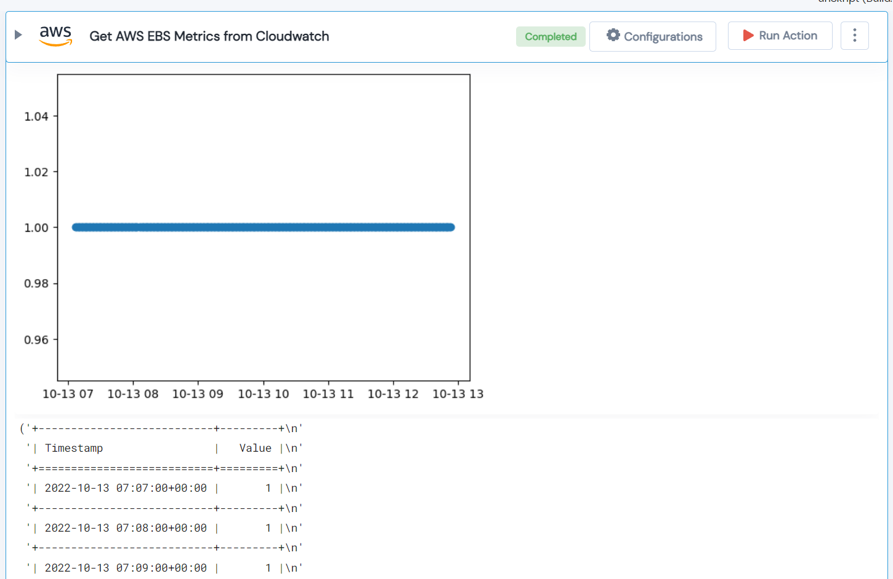

 
<h1>Get AWS EBS Metrics from Cloudwatch </h1>

## Description
This Lego get AWS CloudWatch Statistics for EBS volumes.

## Lego Details

    aws_get_cloudwatch_ebs(hdl: Session, metric_name: EBSMetrics, volumes: List[str], region: str, timeSince: int,statistics: StatisticsType, period: int)

        hdl: Object of type unSkript AWS Connector.
        metric_name: The name of the EBS metric.
        volumes: List of EBS volumes
        timeSince: Starting from now, window (in seconds) for which you want to get the datapoints for.
        statistics: Cloudwatch metric statistics.
        period: The granularity, in seconds, of the returned data points.
        region: AWS Region of the cloudwatch.

## Lego Input

This Lego take seven inputs hdl, metric_name, volumes, timeSince, statistics, period and region.

## Lego Output
Here is a sample output.

## See it in Action

You can see this Lego in action following this link [unSkript Live](https://us.app.unskript.io)