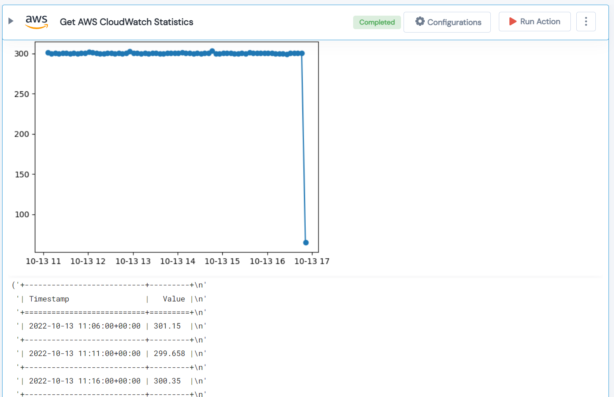

 
<h1>Get AWS CloudWatch Statistics </h1>

## Description
This Lego get AWS CloudWatch Statistics.

## Lego Details

    aws_get_cloudwatch_statistics(hdl: Session, name_space: str, metric_name: str, dimensions: List[dict], region: str, timeSince: int,statistics: StatisticsType, period: int)

        hdl: Object of type unSkript AWS Connector.
        name_space: he namespace of the metric, with or without spaces. For eg: AWS/SQS, AWS/ECS
        metric_name: The name of the metric, with or without spaces.
        dimensions: A dimension is a name/value pair that is part of the identity of a metric.
        timeSince: Starting from now, window (in seconds) for which you want to get the datapoints for.
        statistics: Cloudwatch metric statistics.
        period: The granularity, in seconds, of the returned data points.
        region: AWS Region of the cloudwatch.

## Lego Input

This Lego take eight inputs hdl, name_space, metric_name, dimensions, timeSince, statistics, period and region.

## Lego Output
Here is a sample output.

## See it in Action

You can see this Lego in action following this link [unSkript Live](https://us.app.unskript.io)