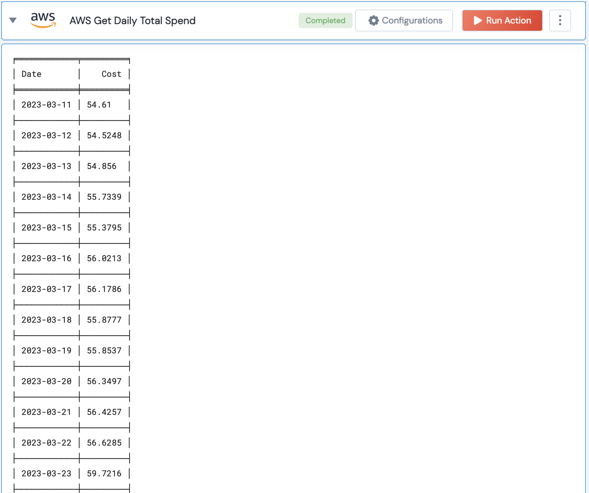

[]
(https://unskript.com/assets/favicon.png)
<h1>AWS Get Daily Total Spend</h1>

## Description
AWS get daily total spend from Cost Explorer

## Lego Details
	aws_get_daily_total_spend(handle, region:str,number_of_months: int="", start_date: str="", end_date:str="")

		handle: Object of type unSkript AWS Connector.
		number_of_months: Optional, Number of months to fetch the daily costs for. Eg: 1 (This will fetch all the costs for the last 30 days)
		start_date: Optional,,Start date to get the daily costs from. Note: It should be given in YYYY-MM-DD format. Eg: 2023-03-11
		end_date: Optional, End date till which daily costs are to be fetched. Note: It should be given in YYYY-MM-DD format. Eg: 2023-04-11
		region: AWS Region.

## Lego Input
This Lego takes 5 inputs handle, number_of_months, start_date, end_date, region

## Lego Output
Here is a sample output.

## See it in Action

You can see this Lego in action following this link [unSkript Live](https://us.app.unskript.io)