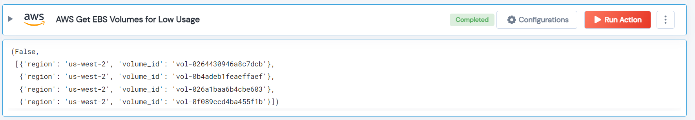

 
<h1>AWS Get EBS Volumes for Low Usage </h1>

## Description
This Lego list low use volumes from AWS which used <10% capacity from the given threshold days.

## Lego Details

    aws_get_ebs_volume_for_low_usage(handle, region: str = "", threshold_days: int = 10, usage_percent: int = 10)

        handle: Object of type unSkript AWS Connector.
        region: Optional, AWS region. Eg: “us-west-2”
        threshold_days: (in days) The threshold to check the EBS volume usage less than the threshold.
        usage_percent: (in percent) The threshold to compaire the EBS volume usage
        less than the threshold.

## Lego Input
This Lego take four inputs handle, threshold_days, usage_percent and region.

## Lego Output
Here is a sample output.

## See it in Action
You can see this Lego in action following this link [unSkript Live](https://us.app.unskript.io)