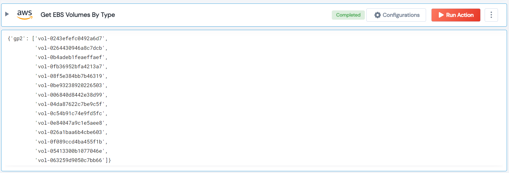

 
<h1>Get EBS Volumes By Type</h1>

## Description
This Lego filter AWS EBS volumes by their type.

## Lego Details

    aws_get_ebs_volumes_by_type(handle, region: str)

        handle: Object of type unSkript AWS Connector.
        region: AWS region. Eg: “us-west-2”

## Lego Input
This Lego take two inputs handle and region.

## Lego Output
Here is a sample output.

## See it in Action
You can see this Lego in action following this link [unSkript Live](https://us.app.unskript.io)