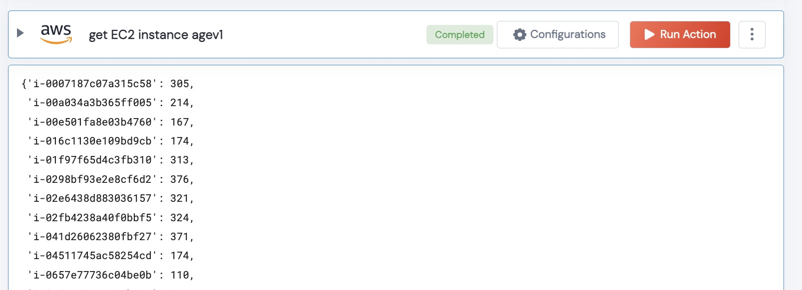

 
<h1>Get Age of All EC2 Instances </h1>

## Description
Given a region, this will query all instances, and give you the age in days of every EC2 instance.

## Lego Details

    aws_get_ec2_instance_age(handle, region: str) 

        handle: Object of type unSkript AWS Connector
        region: Location of the EC2 instances.

## Lego Input
This Lego take two inputs: handle and region.

## Lego Output
Here is a sample output.

## See it in Action

You can see this Lego in action following this link [unSkript Sandbox](https://us.app.unskript.io)

