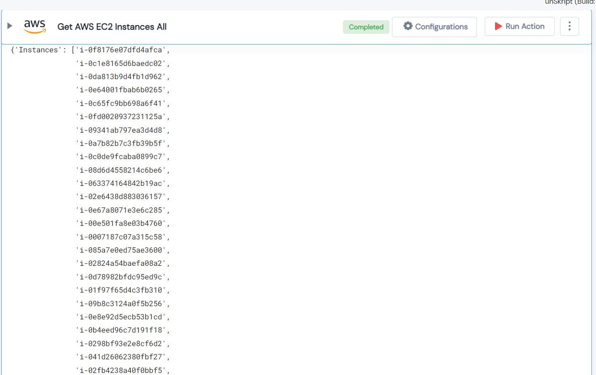

 
<h1>Get AWS EC2 Instances All </h1>

## Description
This Lego used to get AWS EC2 Instances All.

## Lego Details

    aws_filter_ec2_instances(handle: object, region: str)

        handle: Object of type unSkript AWS Connector.
        region: Region to filter instances.
## Lego Input

This Lego take two inputs handle and region.

## Lego Output
Here is a sample output.

## See it in Action

You can see this Lego in action following this link [unSkript Live](https://us.app.unskript.io)