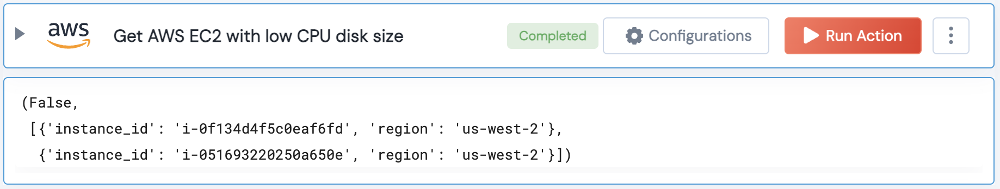

[]
(https://unskript.com/assets/favicon.png)
<h1>Get AWS EC2 with smaller CPU size</h1>

## Description
This action finds EC2 instances with smaller CPU size than threshold. (vCPU count)

## Lego Details
	aws_get_ec2_instances_with_smaller_cpu_size(handle, instance_ids: list = [], region: str = "", threshold: float=2.0)
		handle: Object of type unSkript AWS Connector.
		instance_ids: List of instance IDs to check.
		threshold: The CPU size threshold. Example value is 2.0.
		region: Region to get instances from. (Optional)

## Lego Input
This Lego takes inputs handle, instance_ids, threshold, region.

## Lego Output
Here is a sample output.

## See it in Action

You can see this Lego in action following this link [unSkript Live](https://us.app.unskript.io)