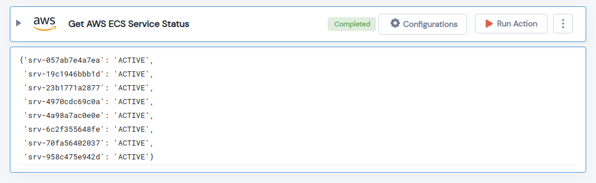

 
<h1>Get AWS ECS Service Status</h1>

## Description
This Lego Get the Status of an AWS ECS Service.

## Lego Details

    aws_get_ecs_services_status(handle, region: str)

        handle: Object of type unSkript AWS Connector.
        region: AWS Region of the ECS service. 

## Lego Input
This Lego take two inputs handle and region. 

## Lego Output
Here is a sample output.

## See it in Action

You can see this Lego in action following this link [unSkript Live](https://us.app.unskript.io)