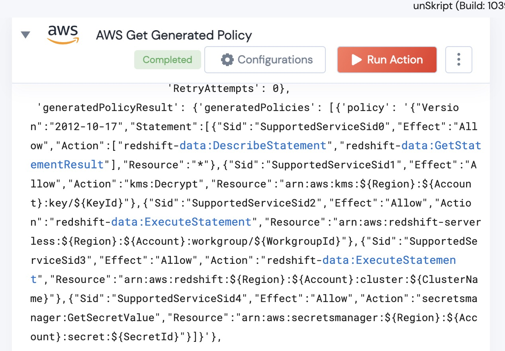

[]
(https://unskript.com/assets/favicon.png)
<h1>AWS Get Generated Policy</h1>

## Description
Given a Region and the ID of a policy generation job, this Action will return the policy (once it has been completed).

## Lego Details
	aws_get_generated_policy(handle, region:str,jobId:str)
		handle: Object of type unSkript AWS Connector.

	region: AWS region of the cloudtrail that is being used to generate the policy
	jobId: The JobID of the policy being generated.

## Lego Input
This Lego takes inputs handle, region and JobId.

## Lego Output
Here is a sample output.

## See it in Action

You can see this Lego in action following this link [unSkript Live](https://us.app.unskript.io)