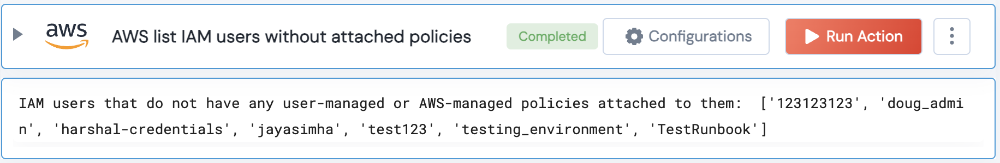

[]
(https://unskript.com/assets/favicon.png)
<h1>AWS list IAM users without attached policies</h1>

## Description
Get a list of all IAM users that do not have any user-managed or AWS-managed policies attached to them.

## Lego Details
	aws_get_iam_users_without_attached_policies(handle)
		handle: Object of type unSkript AWS Connector.

## Lego Input
This Lego takes one input- handle.

## Lego Output
Here is a sample output.

## See it in Action

You can see this Lego in action following this link [unSkript Live](https://us.app.unskript.io)