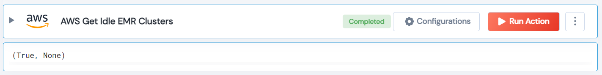

 
<h1>AWS Get Idle EMR Clusters</h1>

## Description
This Lego list of EMR clusters that have been idle for more than the specified time.

## Lego Details

    aws_get_idle_emr_clusters(handle, max_idle_time: int = 30, region: str = "")

        handle: Object of type unSkript AWS Connector.
        region: Optional, AWS region. Eg: “us-west-2”.
        max_idle_time: (minutes) The maximum idle time in minutes.

## Lego Input
This Lego take three inputs handle, max_idle_time and region.

## Lego Output
Here is a sample output.

## See it in Action
You can see this Lego in action following this link [unSkript Live](https://us.app.unskript.io)