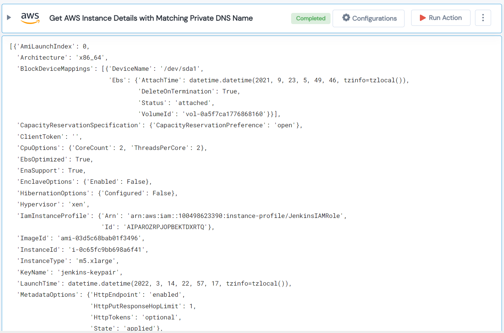

 
<h1>Get AWS Instance Details with Matching Private DNS Name </h1>

## Description
This Lego used to get details of an AWS EC2 Instance that matches a Private DNS Name.

## Lego Details

    aws_get_instance_detail_with_private_dns_name(handle: object, dns_name: str, region: str)

        handle: Object of type unSkript AWS Connector.
        dns_name: Private DNS Name.
        region: AWS Region of the resource.
## Lego Input

This Lego take three inputs handle, dns_name and region.

## Lego Output
Here is a sample output.

## See it in Action

You can see this Lego in action following this link [unSkript Live](https://us.app.unskript.io)