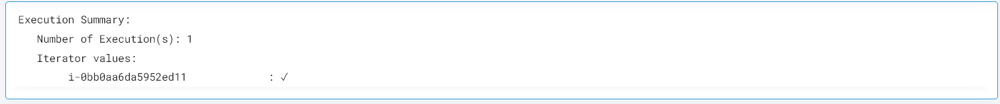
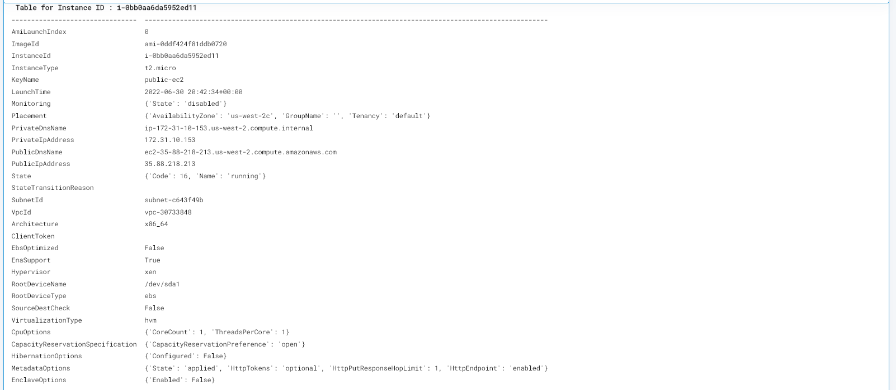

 
<h1>Get AWS Instances Details </h1>

## Description
This Lego gives the AWS EC2 Instances details.

## Lego Details

    aws_get_instance_details(handle: object)

        handle: Object of type unSkript AWS Connector

## Lego Input
This Lego take three inputs region and instance_ids.

## Lego Output
Here is a sample output.

## See it in Action

You can see this Lego in action following this link [unSkript Live](https://unskript.com)