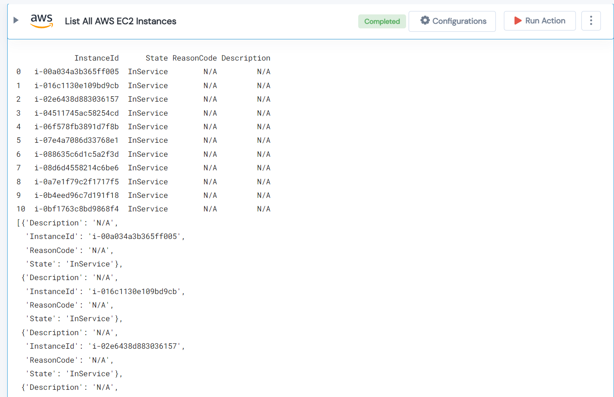

 
<h1>List All AWS EC2 Instances </h1>

## Description
This Lego used to get a list of all AWS EC2 Instances from given ELB.

## Lego Details

    aws_get_instances(handle: object, elb_name: str, region: str)

        handle: Object of type unSkript AWS Connector.
        elb_name: Name of the Elastic Load Balancer Name
        region: AWS Region of the ECS service.
## Lego Input

This Lego take three inputs handle, elb_name and region.

## Lego Output
Here is a sample output.

## See it in Action

You can see this Lego in action following this link [unSkript Live](https://us.app.unskript.io)