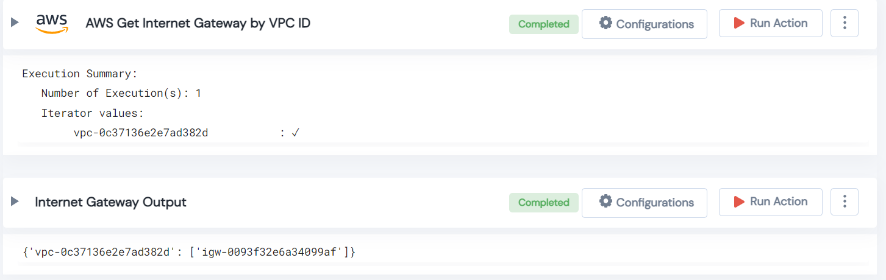

 
<h1>AWS Get Internet Gateway by VPC ID </h1>

## Description
This Lego search for Internet Gateway available for given VPC id.

## Lego Details

    aws_get_internet_gateway_by_vpc(handle, vpc_id: str, region: str)

        handle: Object of type unSkript AWS Connector.
        vpc_id: VPC ID to find Internet Gateway.
        region: Region to filter instance.

## Lego Input

This Lego take three inputs handle, vpc_id and region. 

## Lego Output
Here is a sample output.

## See it in Action

You can see this Lego in action following this link [unSkript Live](https://us.app.unskript.io)