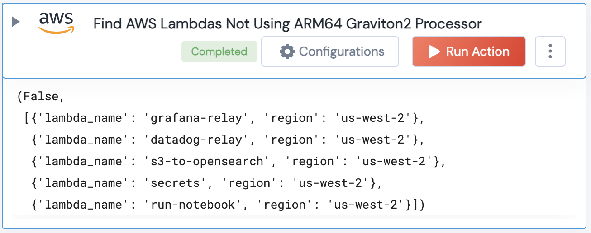

[]
(https://unskript.com/assets/favicon.png)
<h1>Get AWS Lambdas Not Using ARM64 Graviton2 Processor</h1>

## Description
Get all AWS Lambda functions that are not using the Arm-based AWS Graviton2 processor for their runtime architecture

## Lego Details
	aws_get_lambdas_not_using_arm_graviton2_processor(handle,region:str="")
		handle: Object of type unSkript AWS Connector.
		region: Optional, AWS Region

## Lego Input
This Lego takes inputs handle, region

## Lego Output
Here is a sample output.

## See it in Action

You can see this Lego in action following this link [unSkript Live](https://us.app.unskript.io)