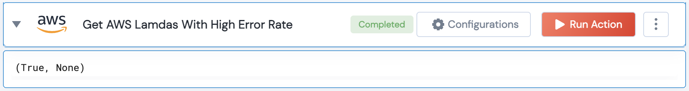

[]
(https://unskript.com/assets/favicon.png)
<h1>Get AWS Lambdas With High Error Rate</h1>

## Description
Get AWS Lambda Functions that exceed a given threshold error rate.

## Lego Details
	aws_get_lambdas_with_high_error_rate(handle, error_rate_threshold:float, days_back:int, region:str="")

		handle: Object of type unSkript AWS Connector.
		region: Optional, AWS Region to get the instances from. Eg: "us-west-2"
		error_rate_threshold: Optional, (in percent) Idle CPU threshold (in percent)
		days_back: Optional, (in hours) Idle CPU threshold (in hours)

## Lego Input
This Lego takes 4 inputs handle,

## Lego Output
Here is a sample output.

## See it in Action

You can see this Lego in action following this link [unSkript Live](https://us.app.unskript.io)