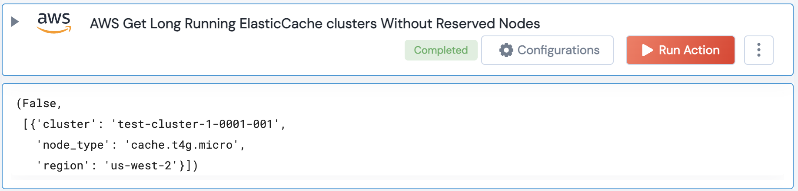

[]
(https://unskript.com/assets/favicon.png)
<h1>AWS Get Long Running ElasticCache clusters Without Reserved Nodes</h1>

## Description
This action gets information about long running ElasticCache clusters and their status, and checks if they have any reserved nodes associated with them.

## Lego Details
	aws_get_long_running_elasticcache_clusters_without_reserved_nodes(handle, region: str = "", threshold:int = 10)
		handle: Object of type unSkript AWS Connector.
		threshold: Threshold(in days) to find long running ElasticCache clusters. Eg: 30, This will find all the clusters that have been created a month ago.

## Lego Input
This Lego takes inputs handle,threshold.

## Lego Output
Here is a sample output.

## See it in Action

You can see this Lego in action following this link [unSkript Live](https://us.app.unskript.io)