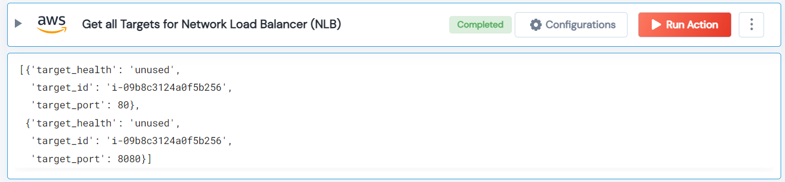

 
<h1>Get all Targets for Network Load Balancer (NLB)</h1>

## Description
This Lego to get all targets for Network Load Balancer (NLB).

## Lego Details

    aws_get_nlb_targets(handle, region: str, nlb_arn: str)

        handle: Object of type unSkript AWS Connector
        region: AWS Region.
        nlb_arn: Network Load Balancer ARNs.

## Lego Input
This Lego take two inputs handle, nlb_arn and region.

## Lego Output
Here is a sample output.

## See it in Action

You can see this Lego in action following this link [unSkript Live](https://unskript.com)