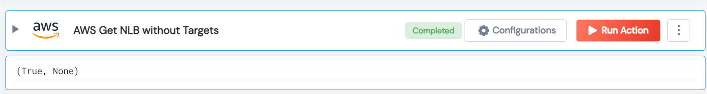

 
<h1>AWS Get Network Load Balancer (NLB) without Targets</h1>

## Description
This Lego to get AWS Network Load Balancer (NLB) without Targets.

## Lego Details

    aws_get_nlbs_without_targets(handle, region: str = "")

        handle: Object of type unSkript AWS Connector
        region: Optional, AWS Region.

## Lego Input
This Lego take two inputs handle and region.

## Lego Output
Here is a sample output.

## See it in Action

You can see this Lego in action following this link [unSkript Live](https://unskript.com)