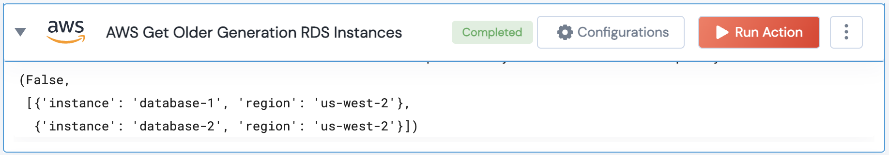

[]
(https://unskript.com/assets/favicon.png)
<h1>AWS Get Older Generation RDS Instances</h1>

## Description
AWS Get Older Generation RDS Instances action retrieves information about RDS instances using older generation instance types.

## Lego Details
	aws_get_older_generation_rds_instances(handle, region: str = "")
		handle: Object of type unSkript AWS Connector.
		region: AWS Region (Optional)

## Lego Input
This Lego takes inputs handle,

## Lego Output
Here is a sample output.

## See it in Action

You can see this Lego in action following this link [unSkript Live](https://us.app.unskript.io)