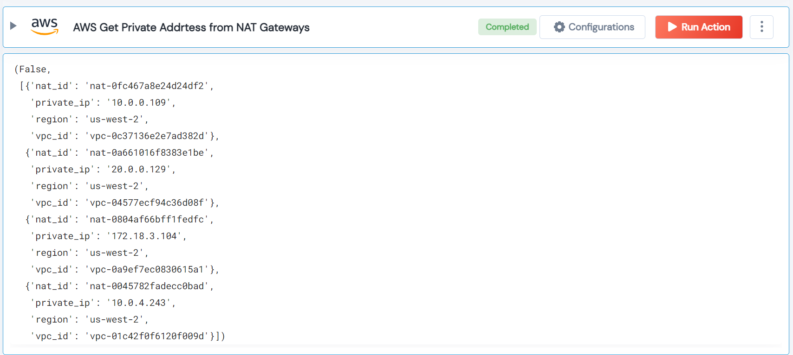

 
<h1>AWS Get Private Addrtess from NAT Gateways </h1>

## Description
This Lego used to get private addrtess from NAT gateways.

## Lego Details

    aws_get_private_address_from_nat_gateways(handle, region: str = "")

        handle: Object of type unSkript AWS Connector.
        region: Optional- Region to filter NAT Gateways.

## Lego Input

This Lego take two inputs handle and region. 

## Lego Output
Here is a sample output.

## See it in Action

You can see this Lego in action following this link [unSkript Live](https://us.app.unskript.io)