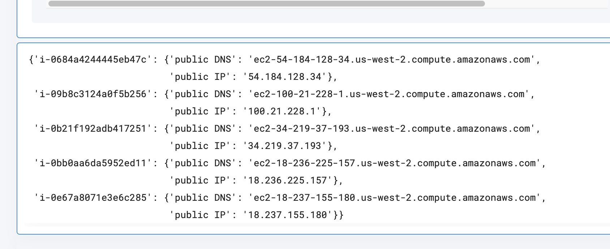

 
<h1>Get AWS public EC2 instances </h1>

## Description
This Lego gets a list of all public AWS EC2 Instances.

## Lego Details

    aws_get_public_ec2_instances(handle: object, region: str)

        handle: Object of type unSkript AWS Connector.
        region: Used to filter the volume for specific region.

## Lego Input
This Lego take two input handle and region.

## Lego Output
Here is a sample output.

## See it in Action

You can see this Lego in action following this link [unSkript Sandbox](https://us.app.unskript.io)