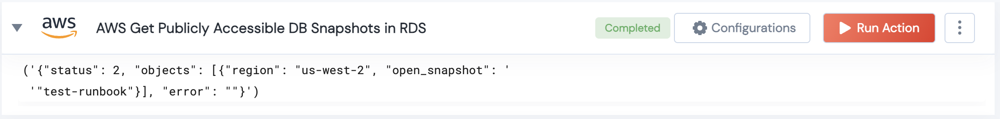

 
<h1>AWS Get Publicly Accessible DB Snapshots in RDS </h1>

## Description
This Lego filter publicly accessible DB snapshots in RDS.

## Lego Details

    aws_get_publicly_accessible_db_snapshots(handle, region: str)

        handle: Object of type unSkript AWS Connector
        region: Region of the RDS.

## Lego Input
This Lego takes two inputs handle,region. 

## Lego Output
Here is a sample output.

## See it in Action

You can see this Lego in action following this link [unSkript Live](https://us.app.unskript.io)