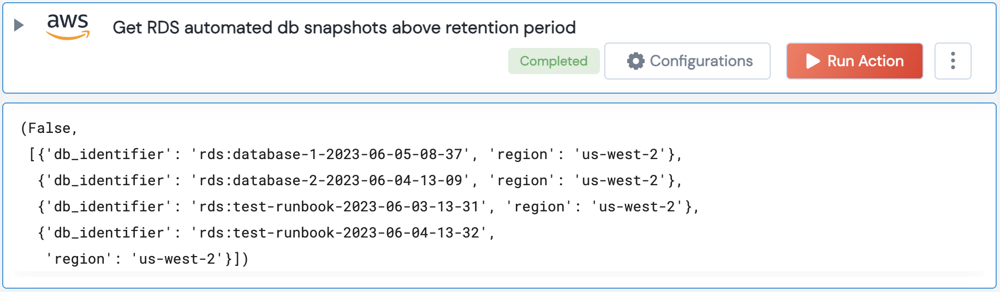

[]
(https://unskript.com/assets/favicon.png)
<h1>Get AWS RDS automated db snapshots above retention period</h1>

## Description
This Action gets the snapshots above a certain retention period.

## Lego Details
	aws_get_rds_automated_snapshots_above_retention_period(handle, region: str="", threshold:int=7)
		handle: Object of type unSkript AWS Connector.
		threshold: The threshold number of days check for retention of automated snapshots. Default is 7 days

## Lego Input
This Lego takes inputs handle, threshold.

## Lego Output
Here is a sample output.

## See it in Action

You can see this Lego in action following this link [unSkript Live](https://us.app.unskript.io)