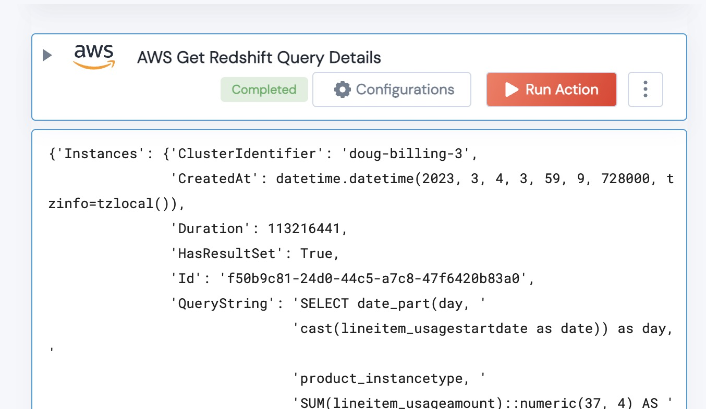

 
<h2>Get Redshift Query Details</h2>

 

## Description
This Action retrieves a Details on a Redshift Query

## Lego Details
   def aws_get_redshift_query_details(handle, region: str, queryId:str) -> Dict:

        handle: Object of type unSkript datadog Connector
		region: AWS Region
		queryId: id of the Redshift query

## Lego Input
        handle: Object of type unSkript datadog Connector
		region: AWS Region
		queryId: id of the Redshift query

## Lego Output
Here is a sample output.

## See it in Action

You can see this Lego in action following this link [unSkript Live](https://us.app.unskript.io)