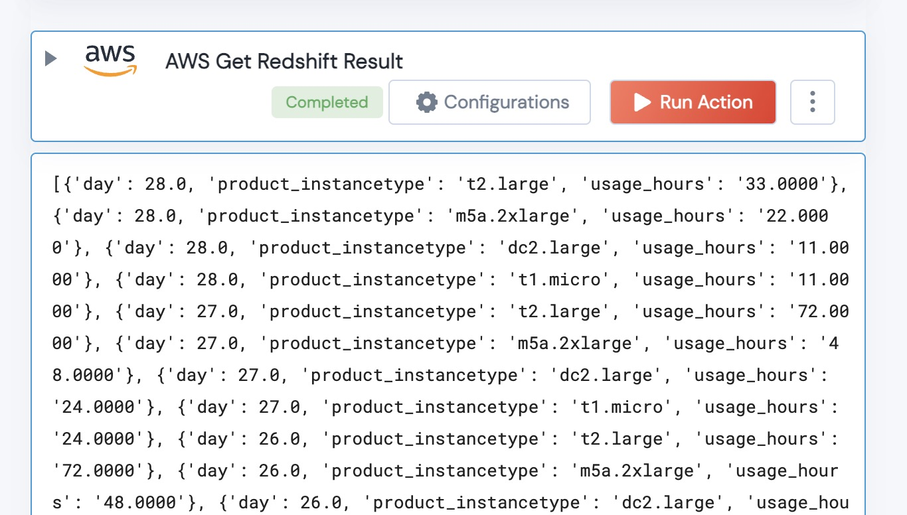

 
<h2>Get AWS Redshift Result</h2>

 

## Description
This Action retrieves a Result from a Redshift Query. Formats the query into a List for easy manipulation into a dataframe

## Lego Details
    def aws_get_redshift_result(handle, region:str, resultId: str) -> List:

        handle: Object of type unSkript datadog Connector
		region: AWS Region
		resultId: QueryId of teh Redshift Query.

## Lego Input
    handle: Object of type unSkript datadog Connector
	region: AWS Region
	resultId: QueryId of teh Redshift Query.

## Lego Output
Here is a sample output.

## See it in Action

You can see this Lego in action following this link [unSkript Live](https://us.app.unskript.io)