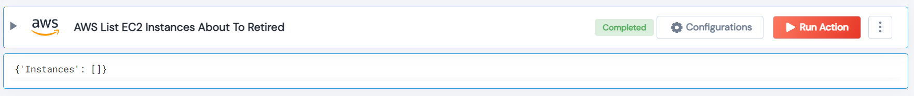

 
<h1>AWS Get EC2 Instances About To Retired</h1>

## Description
This healthcheck Lego filter AWS reserved instance is scheduled to end within the threshold.

## Lego Details

    aws_get_reserved_instances_about_to_retired(handle, region: str, threshold: int = 7)

        handle: Object of type unSkript AWS Connector.
        region: Optional, AWS region. Eg: “us-west-2”,
        threshold: The threshold for the reserved instance is scheduled to end within the threshold.

## Lego Input
This Lego take two inputs handle, threshold and region.

## Lego Output
Here is a sample output.

## See it in Action
You can see this Lego in action following this link [unSkript Live](https://us.app.unskript.io)
