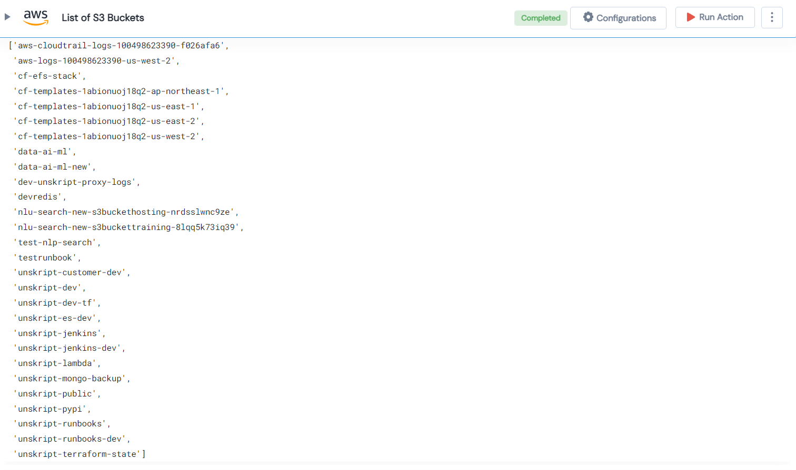

 <h1>Get AWS S3 Buckets </h1>

## Description
This Lego Get AWS S3 Buckets and gives a list of S3 buckets.

## Lego Details

    aws_get_s3_buckets(handle: object, region: str)

        handle: Object of type unSkript AWS Connector.
        region: Used to filter the volume for specific region.

## Lego Input
This Lego takes take one input region.

## Lego Output
Here is a sample output.

## See it in Action

You can see this Lego in action following this link [unSkript Live](https://us.app.unskript.io)